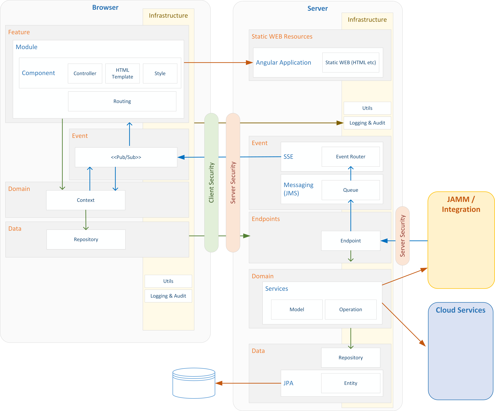

DDU087 - Software Architecture
=
[Back to Read Me](../readme.md)

  
DDU087 will utilise the standard PAMM architecture as defined in https://github.com/gatblau/pamm.seed.  The diagram below shows the tailored version for DDU087 with the following:

- Removed SSE and messaging – No push requirement
- Removed JAMM integration
- Specified Box integration
- Specified MySql DB
  

Scalability
-
Currently, deployment is limited to a single server as there is no provision for sharing content across different Play Servers.  It is envisaged that scaling will be achieved via shared storage such as SAN. 
